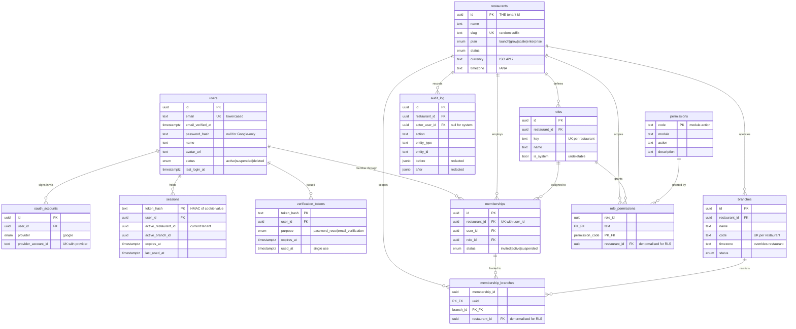

# Phase 0 — Database Design & ER Diagram

## Design decisions

**A restaurant *is* the tenant.** `restaurants.id` is the value carried in
`app.tenant_id` and compared by every policy. There is no separate `tenants`
table to drift out of sync with it.

**Users are global, not per-tenant.** One person, one account, many
memberships — the model Slack and Notion use. A chef working two restaurants
in the group signs in once. The alternative (a user row per restaurant) makes
the same human into several accounts with several passwords, and makes "invite
an existing user" impossible.

**Denormalised `restaurant_id` on join tables.** `role_permissions` and
`membership_branches` carry a `restaurant_id` they could otherwise derive. An
RLS policy can only reference columns on its own table, so without it every
row would need a subquery to be filtered — expensive, and easy to get wrong.

**Money is not in Phase 0.** When it arrives it is integer minor units against
`restaurants.currency`. Never a float.

## ER diagram

## RLS coverage

| Table | RLS | Policies |
| --- | --- | --- |
| `restaurants` | ✅ | `restaurants_tenant_isolation` (ALL), `restaurants_member_read` (SELECT) |
| `branches` | ✅ | `branches_tenant_isolation` (ALL) |
| `roles` | ✅ | `roles_tenant_isolation` (ALL), `roles_member_read` (SELECT) |
| `role_permissions` | ✅ | `role_permissions_tenant_isolation` (ALL) |
| `memberships` | ✅ | `memberships_tenant_isolation` (ALL), `memberships_self_read` (SELECT) |
| `membership_branches` | ✅ | `membership_branches_tenant_isolation` (ALL) |
| `audit_log` | ✅ | `audit_log_tenant_read` (SELECT), `audit_log_tenant_insert` (INSERT) |
| `users` | ❌ | Read before tenant context exists — see security doc |
| `sessions` | ❌ | Same |
| `oauth_accounts` | ❌ | Same |
| `verification_tokens` | ❌ | Same |
| `permissions` | ❌ | Global registry, identical for every tenant |

Eleven policies across seven tables.

### The three self-scoped read policies

`memberships_self_read`, `restaurants_member_read` and `roles_member_read`
exist together for one reason: the tenant switcher. Immediately after login the
session has no active restaurant, so there is no tenant context — yet the user
must still be shown which restaurants they can enter.

They must be added as a set. With only the first two, the join to `roles` in
`listTenantsForUser` matches nothing, the query returns empty, and a user who
legitimately owns a restaurant is told they belong to none — locked out of
their own account.

### Audit immutability

`audit_log` has SELECT and INSERT policies and no UPDATE or DELETE. Postgres
denies whatever a policy does not permit, so the omission *is* the control:
`ros_app` can append and read but cannot alter or erase. An attacker who
reaches application-level code cannot rewrite their own trail. Retention
trimming runs as `ros_owner`, outside the application.

## Indexes

Beyond primary and unique keys:

| Table | Index | Serves |
| --- | --- | --- |
| `users` | `email` (unique) | Login lookup |
| `sessions` | `user_id`, `expires_at` | Bulk revocation; expiry sweep |
| `oauth_accounts` | `(provider, provider_account_id)` unique | Google callback |
| `verification_tokens` | `(user_id, purpose)`, `expires_at` | Reset flow; cleanup |
| `branches` | `restaurant_id`, `(restaurant_id, code)` unique | Tenant listing |
| `roles` | `restaurant_id`, `(restaurant_id, key)` unique | Role resolution |
| `memberships` | `user_id`, `restaurant_id`, `(restaurant_id, user_id)` unique | Both directions of the switcher |
| `audit_log` | `(restaurant_id, created_at)`, `(entity_type, entity_id)`, `actor_user_id` | Trail queries |

Policy predicates compare `restaurant_id` on nearly every table, so those
indexes serve both the application's filters and the policy's.

## Migration

`drizzle/0000_init.sql` — 12 tables, 8 enums, RLS on 7 tables, 11 policies.

Migrations run as `ros_owner` (`DATABASE_URL_MIGRATOR`). Roles are provisioned
separately by `scripts/bootstrap.sql`, which needs superuser — keeping role
creation out of the migration stream means no migration ever requires elevated
privileges.
